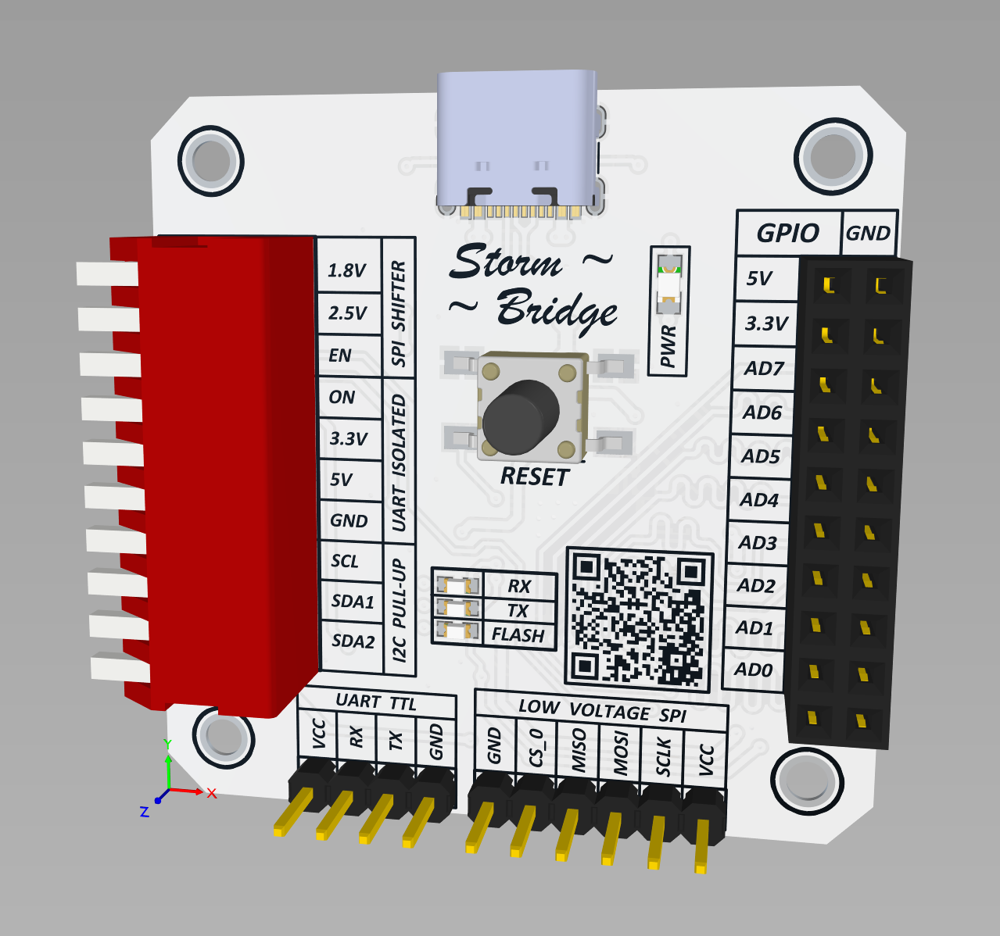

# ~ Storm Bridge ~ (rev0.1)

### Мультиинтерфейсный кроссплатформенный преобразователь USB на базе чипа FT232H.  

 
 
## Содержание:
- [Обзор основных функций](#основные-функции)  
- [Схема устройства](Shematic/Bridge.pdf)  
- Распиновка устройства
- Описание назначения боковых микропереключателей
- Инструкции по эксплуатации Windows:  
  - Настройка драйверов LibUSB, переключение между драйвером FTDI и LibUSB
  - Прошивка SPI-Flash памяти с помощью flashrom v 1.4
  - Настройка связки CubeIDE-OpenOCD для отладки STM32F1
  - Настройка связки VSCode-OpenOCD для отладки GD32
- Инструкция по эксплуатации Linux
  - Настройка окружения на примере Linux Mint v21.1
  - Прошивка SPI-Flash памяти с помощью flashrom v 1.3+
  - Настройка связки Eclipse-OpenOCD для отладки GD32
  - Настройка связки VSCode-OpenOCD для отладки STM32F1
  - Опрос I2C устройства с помощью библиотеки PyFTDI  
- Полезные ссылки и файлы

## Основные функции
Возможность работы высокоскоростной аппаратной работы с интерфейсами UART, SPI, I2C, JTAG/SWD, GPIO.   
Имеется возможность принудительного сброса устройства без извлечения USB коннекторов.  
Присутствует индикация основных режимов работы устройства.  
Связь с хостом осуществляется через разъем USB-TypeC.  
Компактные размеры 44x44x15мм.  

UART:
- Скорость работы до 12Мбод/с. Поддержка 7/8 битный обмен, с 1/2 стоповыми битами.
- Возможность обмена по UART через изолятор с выбором референсного напряжения обмена через пин "VCC" колодки "UART TTL".
- Референсное напряжение изолированной стороны может варьироваться от 5.5 до 3 вольт (до 2.8 в модификации с изолятором ISO7221CDR).
- Возможность принудительного выбора напряжения обмена между 3.3 и 5 вольт и принудительного выключения гальванической развязки, принудительного выключения микросхемы изолятора.
- Возможность обмена по UART на пониженном напряжении через преобразователь логических уровней, выбор напряжения обмена может выбираться автоматически через пин VCC референсного напряжения колодки "LOW VOLTAGE SPI", либо выбираться принудительно между 2.5 и 1.8 вольт.
- Так же имеются расширенные сигналы UART такие как RTS / CTS / DTR / DSR / DCD доступные на колодке "GPIO" работающие на напряжении 3.3в (толерантны к 5в).

SPI:
- Возможность обмена по интерфейсу SPI частоте до 30МГц.
- Напряжение сигнальных линий через колодку "GPIO" - 3.3в (толерантны к 5в).
- Возможность внутрисхемного программирования микросхем памяти SPI с низковольтными логическими уровнями. 
- Для работы с низкими логическими уровнями в устройстве предусмотрен двунаправленный преобразователь логических уровней. 
- Выбор референсного напряжения может происходить автоматически через пин "VCC" колодки "LOW VOLTAGE SPI", в диапазоне от 1.2 до 3 вольт.
- Возможность принудительного выбора напряжения обмена на колодке "LOW VOLTAGE SPI" между 1.8 и 2.5 вольт.
- Предусмотрена схема автоматического перевода сигнальных линий преобразователя в высокоимпедансное состояние, в те моменты когда не производится запись, для исключения влияния устройства на работу внутрисхемной памяти.

I2C:
- Возможность обмена по интерфейсу I2С на напряжении от 1.2 до 5 вольт.
- Возможность принудительной подтяжки линий SDA / SCL к напряжению 3.3 вольта.

JTAG/SWD:
- Возможность внутрисхемного программирования и отладки микроконтроллеров имеющих возможность работать через интерфейс SWD и JTAG (TCK,TDI,TDO,TMS) через GDB/OpenOCD. 
- Краткий список поддерживаемых устройств приведен на сайте OpenOCD и выглядит следующим образом:
Debug targets:  
ARM: AArch64, ARM11, ARM7, ARM9, Cortex-A/R (v7-A/R), Cortex-M (ARMv{6/7/8}-M),
FA526, Feroceon/Dragonite, XScale.
ARCv2, AVR32, DSP563xx, DSP5680xx, EnSilica eSi-RISC, EJTAG (MIPS32, MIPS64),
ESP32, ESP32-S2, ESP32-S3, Intel Quark, LS102x-SAP, RISC-V, ST STM8,
Xtensa.  
Flash drivers:  
ADUC702x, AT91SAM, AT91SAM9 (NAND), ATH79, ATmega128RFA1, Atmel SAM, AVR, CFI,
DSP5680xx, EFM32, EM357, eSi-RISC, eSi-TSMC, EZR32HG, FM3, FM4, Freedom E SPI,
GD32, i.MX31, Kinetis, LPC8xx/LPC1xxx/LPC2xxx/LPC541xx, LPC2900, LPC3180, LPC32xx,
LPCSPIFI, Marvell QSPI, MAX32, Milandr, MXC, NIIET, nRF51, nRF52 , NuMicro,
NUC910, Nuvoton NPCX, onsemi RSL10, Orion/Kirkwood, PIC32mx, PSoC4/5LP/6,
Raspberry RP2040, Renesas RPC HF and SH QSPI,
S3C24xx, S3C6400, SiM3x, SiFive Freedom E, Stellaris, ST BlueNRG, STM32,
STM32 QUAD/OCTO-SPI for Flash/FRAM/EEPROM, STMSMI, STR7x, STR9x, SWM050,
TI CC13xx, TI CC26xx, TI CC32xx, TI MSP432, Winner Micro w600, Xilinx XCF,
XMC1xxx, XMC4xxx.  

GPIO:
- Возможность использовать порты ввода вывода AD0-AD7 на колодке GPIO в качестве портов общего назначения.  

